# Software Design Document

## For Mortgage Calculator

Easter Institute of Technology NZ Bachelor of Computing Systems
ITPR7.508 Business Application Programming
Katherine Mulder & Alex Borawski
20/03/2024

## Table of Contents

- [Revision History](#revision-history)
- [1. Introduction](#1-introduction)
  - [1.1 Document Purpose](#11-document-purpose)
  - [1.2 Subject Scope](#12-subject-scope)
- [2. Analysis/ Reflection of Business Issues](#2-analysis-reflection-of-business-issues)
- [3. Analysis \& Reflection of the Program Specifications](#3-analysis--reflection-of-the-program-specifications)
  - [3.1 Graphical User Interface](#31-graphical-user-interface)
  - [3.2 User Accounts](#32-user-accounts)
  - [3.3 Data Entry Structure](#33-data-entry-structure)
  - [3.4 Analytical Functionality](#34-analytical-functionality)
  - [3.5 Data Removal Processes](#35-data-removal-processes)
- [4. Key areas of software application issues](#4-key-potential-software-application-issues)
  - [4.1 Reliability](#41-reliability)
  - [4.2 Scalability](#42-scalability)
  - [4.3 Performance](#43-performance)
  - [4.4 Maintainability](#44-maintainability)
  - [4.5 Security](#45-security)
  - [4.6 Usability](#46-usability)
  - [4.7 Compatibility](#47-compatibility)
- [5. System Overview](#5-system-overview)
  - [5.1 Software Development](#51-software-development-technologies-and-tools)
- [6. Data Design](#6-data-design)
  - [6.1 Entity Relationship Diagram](#61-entity-relationship-diagram)
  - [6.2 Data Flow Diagram](#62-data-flow-diagram)
- [7. System Design](#7-system-design)
  - [7.1 User Case Diagram](#71-user-case-diagram)
  - [7.2 Component Diagram](#72-component-diagram)
  - [7.3 Activity Diagram](#73-activity-diagram)
  - [7.4 Class Diagram](#74-class-diagram)
- [8. Interface Design](#8-interface-design)
  - [8.1 Wireframes](#81-wireframes)
- [9. Test Framework](#9-test-framework)
- [10. Definitions, Acronyms and Abbreviations](#10-definitions-acronyms-and-abbreviations)
  - [Data Design Diagrams](#data-design-diagrams)

## Revision History

| Name | Date | Reason For Changes | Version |
|------|------|--------------------|---------|
|      |      |                    |         |
|      |      |                    |         |
|      |      |                    |         |

## 1. Introduction

> This document outlines the architecture and design of the proposed Mortgage Calculator (calculator). This calculator aims to simplify mortgage management processes for individuals by offering a user-friendly interface and comprehensive features. It is important to note that this calculator is intended for personal use only and is not designed for financial advisers or professional consultation.
>This Software Design Document serves as a detailed guide for developers, stakeholders, and users, providing insights into the software's functionality, structure, and behavior. This includes data design, system design, interface design, and testing framework.

### 1.1 Document Purpose

This document explains how the Mortgage Calculator works and how it is built. This is designed to make it easy to understand how the software functions and what it will look like. We have included a user required specifications document that defines what users can expect from this project.

- Users/ Project manager: This document serves as a guide for both project managers and users of the Mortgage Calculator. It provides the software's functionality, design rationale, usability aspects, and system behavior. By understanding these details, users and project managers can make informed decisions about the project, while users can use the software to meet their needs.

- Developers: This guide helps developers understand the software design, important decisions made about its structure, and how it is built. It provides a roadmap for developers to turn requirements into a working program.

### 1.2 Subject Scope

**Scope Summary:**

The Scope for the Mortgage Calculator is as follows:

- **Project Includes:**

> 1. A Mortgage Calculator that will be able to take mortgage information given by a user and return an analysis of the mortgage in the form of a summary, graph /and table.
• Users will be able to adjust to their mortgage's information in the form of a transaction, which when completed, will update the analysis given the new information from the given date.
• Users will be able to adjust the period the analysis is showing from.
• Users will be able to create an account within the Calculator application, allowing them to save their mortgage(s) information and transaction information to a separate database.
> 2. Establishing a database to contain data from the Mortgage Calculator
• A file to run to initialize the database to be run before the first use of the Mortgage Calculator application alongside documentation to help this process.
> 3. Testing the software to ensure that any major issues are dealt with.
• All test files will be included in the final delivery of the project.
> 4. User documentation containing instructions on how to use the Mortgage Calculator

- **Project Excludes:**

> 1. Complex mortgage types:
• Adjustable-rate mortgages (ARMs) with various index rates and margins will be excluded.
> 2. Deployment:
• The project will focus on developing the website and its functionalities but will not involve the deployment process onto live servers.
> 3. Search Engine Optimisation (SEO) services:
• The project will not include SEO services beyond basic considerations for website visibility.
> 4. Maintenance and updates:
• Post-project maintenance and updates will not be covered under this project. This includes ongoing software support and updates.
> 5. Advanced financial analysis:
• The project will focus solely on basic mortgage calculations and will not include advanced financial analysis features.
> 6. Legal advice:
• The project does not include any legal advice related to mortgages. Users will need to seek independent legal advice.
> 7. Tax advice:
• The project does not include tax advice. Users will need to consult with tax professionals or refer to relevant tax regulations for any tax-related matters.
> 8. Integration with external systems:
• The project will not include integration with external systems beyond the scope of basic mortgage functionalities.

## 2. Analysis/ Reflection of Business Issues

In this section, we delve into the process of reflection and analysis regarding key business issues we have encountered, and we will examine the rationale behind the decisions we have agreed upon and provide clear justifications grounded in various considerations. 
3.1	The first stage of the initial set-up
Analysis: Getting started is really important because it's the base of the whole mortgage management system. Users have to enter the right info to make sure their mortgage gets handled right.
Reflection: To deal with this problem, the system has to make it easy and simple to set up. It should give clear instructions and check that everything's correct.

3.2	Update mortgage
Analysis: It's normal for people's finances or loan terms to change when they have a mortgage. Users should be able to easily and accurately update their mortgage info in the system.
Reflection: The system should let users make these updates themselves. It needs to make sure the changes show up correctly.
3.3	Transaction reporting
Analysis: Transaction reports help users see their payment history and how much they still owe.
Reflection: It's important for users to have detailed and easy-to-understand transaction reports so they can keep track of their history and understand what's going on.
3.4	Mortgage editing
Analysis: Sometimes, mortgage agreements have to change because of different situations or what users want. Users need to be able to change certain details of their mortgage while making sure everything stays accurate and consistent.
Reflection: Adding editing features is really important to make sure users can do what they need to with their mortgage.
3.5	Visualization chart
Analysis: Having pictures of mortgage data can help users understand their money situation and how they've been paying. Users need charts that show their mortgage info clearly.
Reflection: Adding charts can make it easier for users to understand and get interested in their mortgage.
3.6	Authentication
Analysis: Users need a process to create and manage their accounts. 
Reflection: Building an authentication system that allows users to log in, log out, change passwords, and delete accounts is essential.

3.7	Personalization
Analysis: Users should have the flexibility to edit or delete historical transactions to ensure the accuracy of their financial records. 
Reflection: Users with full control over their dashboard and mortgage details and implement user-friendly editing and deletion options for historical transactions, allowing users to easily make changes as needed.
3.8	Intuitive interface
Analysis: An intuitive interface is important for ensuring that users can easily navigate the mortgage management system and access its features without confusion. 
Reflection: We should test how easy it is to use and ask users for feedback to find any problems or confusing parts. Then, we can make changes to the design to make sure it's what users want and expect. Doing these tests regularly and updating the system is important to keep it easy to use.

## 3. Analysis & Reflection of the Program Specifications
In reflecting on the program specifications, we'll analyze the final software application and consider any necessary changes or modifications. Also, identify any potential gaps or inconsistencies and propose adjustments to ensure the successful implementation of the software.
### 3.1 Graphical User Interface

Users will be greeted with a login page to access their accounts. There will also be a separate page to create an account. Alongside this, once logged into the application, there will be a user settings page to allow for password changes or account deletion.

The program will have a simple interface designed to quickly provide analysis of a mortgage. To be able to do this, the main page of the application will contain all the information relating to the analysis of mortgages, primarily a table of summarized analysis, a graph showing the change in equity over time, and an amortization table showing specific timestamped information.

There will be a separate interface to allow for the creation of a mortgage and transactions. Due to the amount of information required for each of these sections, they will have their own page. The user will then be able to see some analysis of the information they enter before saving it permanently and returning to the home page.

Lastly, there will be a page to allow users to remove mortgages and transactions that no longer want, listing them out showing identifying information, so they can correctly select the ones they want to remove.

### 3.2 User Accounts

User Accounts will be implemented in the software to separate mortgages (and subsequently transactions) from other users, with no access whatsoever being allowed between users.
These accounts will require a password to secure the account. Primarily, due to the scale of the project, there is no plan to include an admin account to access and manage users from within the application itself, but there will be a way to access the information from the database end, allowing changes to be made there if necessary.

### 3.3 Data Entry Structure

With the calculator requiring a lot of specific information for both mortgages and transactions, these pages will be kept simple and straightforward to help users correctly entry information into the right field. All entry fields will have a description next to their titles outlining the correct formatting. Additionally, the entry fields in the transaction creation screen will include automatically inputted data from the mortgage that is selected so the users only need to adjust the information in the fields that need changes.
Lastly, if any information is entered incorrectly, the entry fields will highlight red and an error message will be displayed to let the user know that something in this field is wrong.

### 3.4 Analytical Functionality

The application will need to handle a lot of analysis, and most of it will be done as a user creates a mortgage or transaction to show on the page before a user confirms this is correct. This analysis will include the Estimated Repayment, a payment breakdown of interest and principal and information regarding the mortgage maturity (including payments over full term, full term to amortize, interest over the full term and principal + interest). It is important to understand that in the transaction creation screen there will be added information to showcase any extra payments, the payments over the reduced term, estimated reduced term to amortize, interest over the reduced term, interest saved over the reduced term and principal + interest over the reduced term.

This information will then be used to generate a graph (viewable on both the main page and creation pages) and an Amortization table (main page only) based on the state of the mortgage. The state will be determined by combining the initial details of the mortgage and applying any transactional changes that have occurred to it at the correct time. Users will also be able to apply a starting date to the analysis on the main page, only seeing the start of the mortgage from that date.

### 3.5 Data Removal Processes

Another important function of the application will be the ability to remove data from the system. Users will be able to remove any mortgages or transactions they want through a single page which will show a table for each type of data, containing all of their entries.Transactions will show the date they were applied, a comment on the purpose of the transaction, and the mortgage that it relates to. For mortgages, it will show the start date of the mortgage, the name given to the mortgage, as well as the current balance remaining on the mortgage. Then, next to all of these entries will be a deleted button that if clicked will show a popup confirming the deletion of the selected entry, with a yes button to confirm, and if selected, the data will be removed.

There will be a way to completely delete the account if the user decides to.This option will be accessible under the user setting page,and if selected and confirmed, it will delete the account and return to the login page.

For all these forms of data removal, if data that is reliant on that deleted entry exists, it will also be removed, e.g., if a user deletes a mortgage, all connected transactions will be removed as well.

## 4. Key potential software application issues

There are some important areas the software will need to handle/work with to deliver a complete solution to the client.

### 4.1 Reliability

Because we are working with financial information, we need to ensure the application runs reliably. With this in mind, we will make sure our application correctly handles any mathematical data entered to ensure accurate results, as this is the core functionality of the Mortgage Calculator. The most common areas that could impede this are rounding errors or inputting data out of the range of the expected field. The best way to overcome this is to include robust error checking in our code to ensure that this is mitigated as much as possible. Robust error checking will be extended throughout the software to make sure that the program is as reliable as possible. More information about this will be available in our Test framework, which will show how we intend to ensure that our application catches these errors.

### 4.2 Scalability

Although this software isn't intended to be scaled up to a larger audience, designing the code in a way that allows added features to be included is important to allow for future flexibility of the program. To allow for this, the code will be designed in a more modular way, with set definitions for classes and different aspects of the code, this will allow future developers to more efficiently make adjustments to the code to suit their needs. Another way to allow for future scalability is through the design of the application as a whole, creating an application environment that can be easily integrated into a wider reaching framework.

### 4.3 Performance

The performance of the application is important because the analysis should be readily available to the user when they log into the application. This is the biggest bottleneck in the application and will require deciding the code to load analyses as quickly as possible. Multi-threading is a potential solution, but most certainly we will be loading all the analyses of a user when they log in to the application to speed up load times.

### 4.4 Maintainability

Although our involvement in the application will cease once the development is complete, we will still develop the application to be easily maintained well into the future. The main way we will deliver on this is designing the code to be modular, with clear signs of what each section of the code is responsible for. Comments within the code will be in depth,covering the functionality of what each section does, how it does it, and what is not included on launch. This will help future developers understand what is happening within the software and how they can quickly edit, add or remove sections to suit their needs.

### 4.5 Security

It will be important to handle data securely within our application, especially as we are dealing with users' sensitive financial information. The most likely vulnerability is that users might be able to access the other user's data without authorization, which means we need to include robust methods to prevent this from happening.

Another potential vulnerability is entering malicious data into the data entry fields throughout the application. To prevent this, we will include a lot of data validations, ranging from type checking, length checking and value checking.

We will also want to secure sensitive data that even administrators should not directly access. To do this, we will use a form of encryption, making the data much harder to access.

### 4.6 Usability

We will make sure the application is easy to understand and navigate through. To do so, we will design the pages, and the connections between them, to be easily identifiable. Clearly showing the user what is present on a page and what is to be expected on the next page, it will make the application as a whole easier to understand.

Another aspect of making the software easy to use is giving clear feedback to any errors inputted by the user, as well as clearly highlighting what each part of the interface is doing. To achieve this, we will provide clear feedback to the user after they try and enter incorrect data, explaining what they did wrong. By including descriptions alongside any data input or display areas, we will make it much clearer what is expected or shown to the user.

### 4.7 Compatibility

Our software will be designed in a manner that makes it more compatible with potential future changes to the environment in which it is operating. With this in mind, we will develop the software to easily support changes in the way the application is used. By isolating the ways in which the software accesses a database and how it displays itself on a web browser, we can make it easier to swap out or augment how the application is used.

## 5. System Overview

Factoring in everything discussed in the previous sections of this document, we have decided to develop an application that connects to an external database to save user's data. This would then connect to our software to create analyses of the user's mortgage(s) and then display this information to the user via a web browser.

This design approach allows us to keep the application small and lightweight, extremely portable and modular, allowing for different usages to be added or removed in the future, whilst also providing flexibility in how the program is presented to the user via a Graphical User Interface, especially as the default browser of the hardware will be used to render the interface.

Below, we have chosen the specific software we will use to develop this application and why it was chosen over other similar options.

### 5.1 Software Development Technologies and Tools

For the backend logic and data processing, we have decided to use Python as the programming language. This decision was reached as Python is a language easily readable by most developers, whilst also providing simple ways to import potential packages that might be necessary for the project.

By working with a web browser, we have elected to use HTML, CSS, and Javascript to create and design our web pages for the project. We will also use bootstrap to access pre-designed features that make the software more standardized.

We decided to follow a Web framework to make the routing and delivery of web pages more streamlined and easier to understand and modify in the future. With these in mind, we chose Flask as our framework, as it is straightforward to set up and configure as well as understand what each part of the software does.

To handle our data storage, we have decided to use Postgres. The main reasonwe decided to use Postgres was because of how simple it is to set up and that it can handle small to large data extremely well, meaning that if the software was to be scaled to meet a larger audience, it would still handle the data with ease.

To test our software, we will make use of Pytest as it automates the unit testing of our software, ensuring that the code can handle all predicted problems correctly.

## 6. Data Design
Data design is about organizing data so we can store, find, and use it easily. In our project, good data design is important because it helps keep our data accurate, makes things run faster, and ensures everything works as it should. We'll use diagrams like ERDs and DFDs to show how our data is set up and how it moves around in our system.

### 6.1 Entity Relationship Diagram

The purpose of the Entity-Relationship Diagram(ERD) is to visually represent the structure of the database for the mortgage calculator. By mapping out entities like "User," "mortgage", "transaction", along with their attributes and relationships. The ERD will provide a clear understanding of how data is organized within the system.

### 6.2 Data Flow Diagram

The Data Flow Diagram (DFD) serves to illustrate the flow of data within the system, showing how data is input, processed, and output. It helps to understand the flow of information and the interactions between different components within the software.
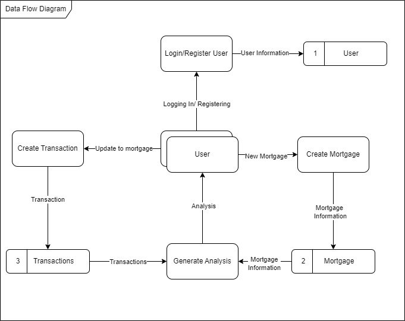

## 7. System Design
We will provide comprehensive user case, component, activity, and class diagrams to illustrate the structure and implementation of our project system.

### 7.1 User Case Diagram

The use case diagram outlines the interactions between users and the system, including the primary functions such as calculating mortgage payments, viewing amortization schedules, adjusting parameters, and accessing mortgage features.

### 7.2 Component Diagram

The component diagram shows the overviewof how the components of our software will be designed and communicate with each other.As shown in the diagram below, the software will need to communicate externally with Postgres to store the data,which is then handled by the Data Models,ran through the analysis, amortization and graphing components to then produce the interface.
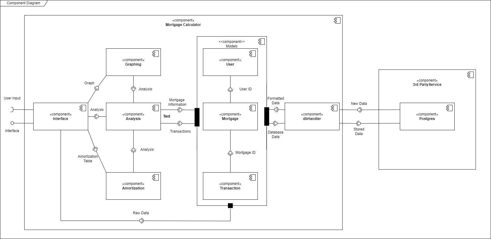

### 7.3 Activity Diagram

The activity diagram is the sequence of actions involved in performing tasks such as inputting data, calculating mortgage payments, viewing amortization schedules, adjusting parameters, and so on. Each activity is connected through transitions, showing the flow of control within the system.

> 1. Users' login activity diagram
> 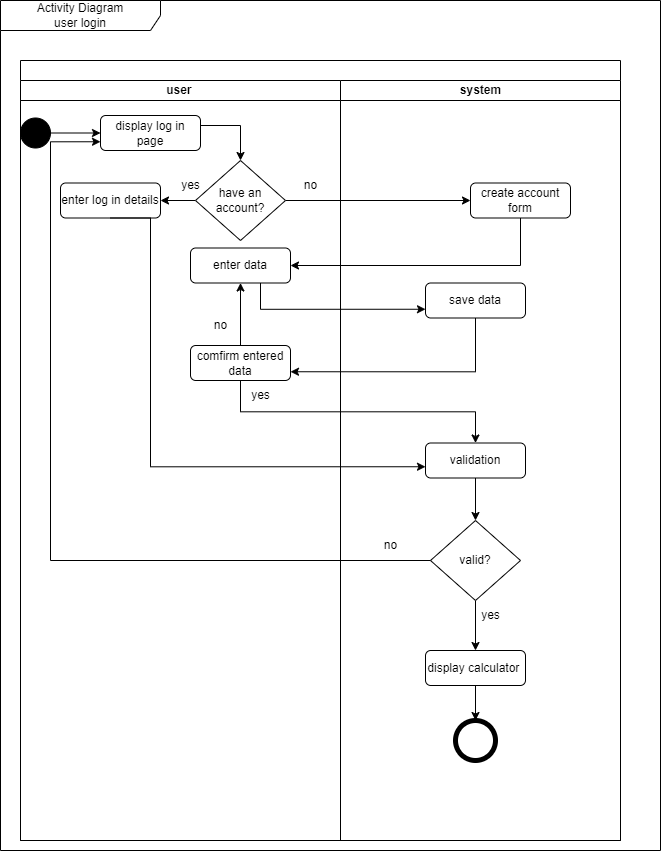
> 2. Users' add mortgage activity diagram
> 
> 3. Users' edit mortgage activity diagram
> 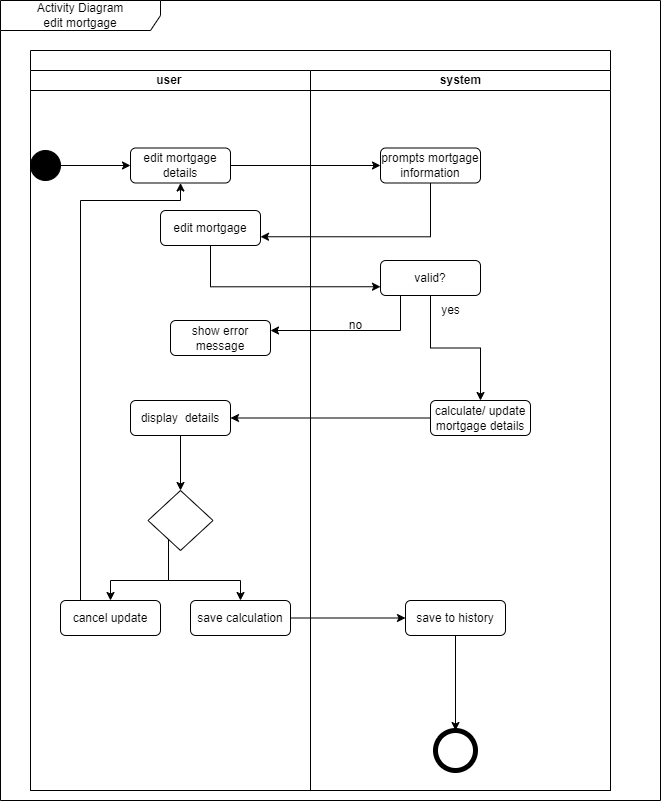
> 4. Users' viewing mortgage activity diagram
> 

### 7.4 Class Diagram

> The class diagram shows the structures of the various classes
> used throughout the application as well as the methods that are inherent to those classes.
> This helps drive our object orientated programming to work smoothly.
> 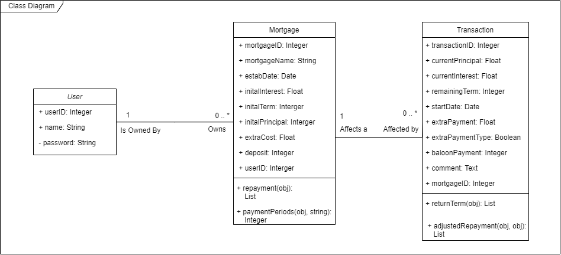

## 8. Interface Design

### 8.1 Wireframes
We will be shaping how users interact with our system by using wireframes. These wireframes serve as skeletal outlines of our webpages, showcasing the structure and placement of elements. By leveraging wireframes, we can plan and visualize the layout of our interface.

**User login page**
This log in page will display before entry the calculator. This page gives users options for log-in and sign-up an account.
> 
**Sign up page**:
In this page, users can sign up an account by providing user name and password.
> 
**Index page**: Users will be able to view their transaction reports on this page. Where users can add new mortgage, update mortgage, and delete data. This page gives the users of overall of their summary data and mortgage maturity.

**Add mortgage page**: This page allows users to input a new mortgage. 
> 
**Update mortgage page**: After a new mortgage is established, the user will be able to edit mortgage on this page or when they click update mortgage button on the index page. This page will display current mortgage details and allow users to update the information. Users can analysis override payment and add extra costs if there is any. A comment text area for comment on the costs.
_Note:_ The numbers in the input fields are an example.
> 
**Deleting Data Page**: If users wish to delete existing transactions or mortgages, they can access this page through the removing data button on the index page.
They will see a table of both mortgages and transactions with identifying information so that they can remove exactly what they want to remove.
 > 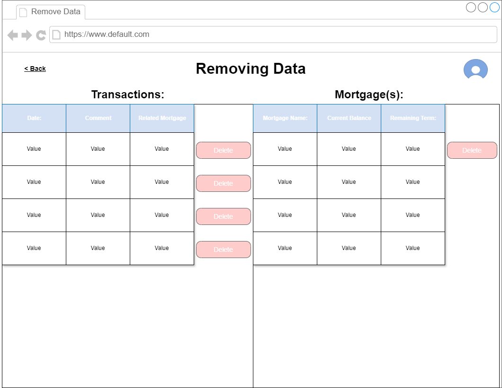
**User account icon**:
 When a user clicks the user icon on the top right page, then a pop-up window will appear for user to update their account information.
> 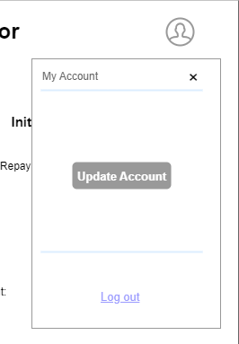
** Update Account**:
 After a user click update account from the pop up window, a new page will appear for the user to choose whether they want to log-out, delete their account or change their password by click account setting button.
> 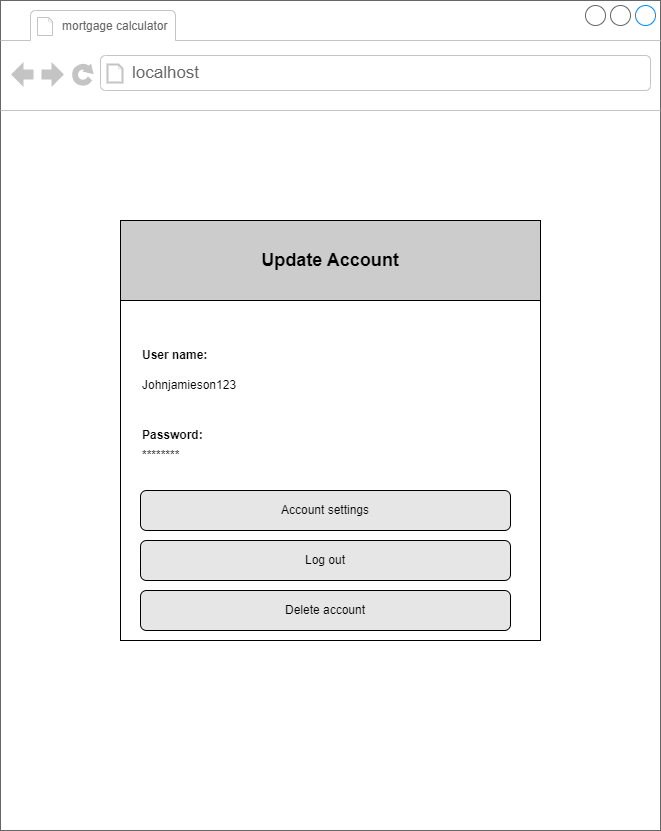
**User account settings**:
When user clicks account setting, this page will appear for user to change their password or if they decide not to then they can click logout back to the home page.
> 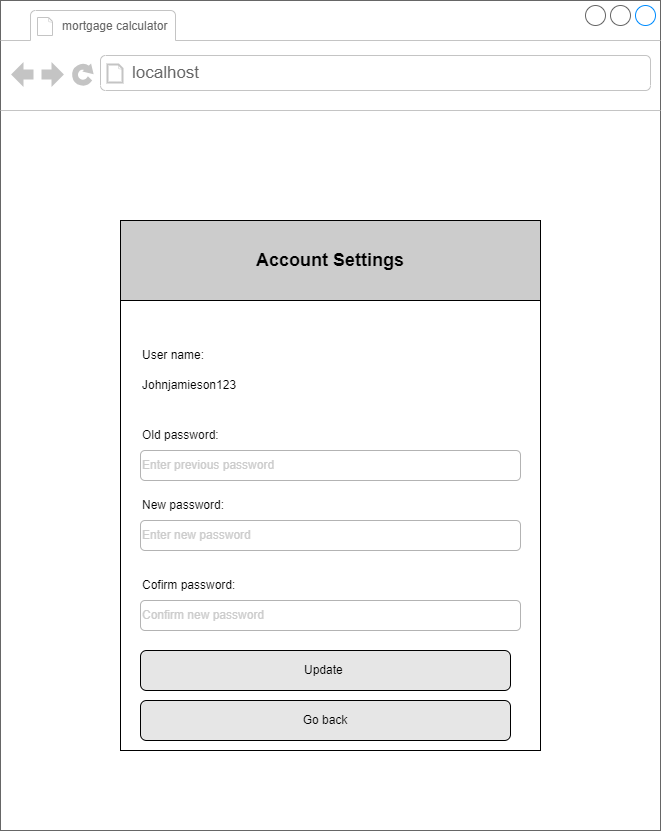

## 9. Test Framework

_Unit Testing_
The main objective is to isolate written code and determine if it works as it should, so we can detect early flaws in code. We will focus on creating unit test cases before developing the actual code by using automated unit testing for validating the functionality.

Code example:
This code defines a class Mortgage with properties and setters for the attribute principal, as well as some other values.
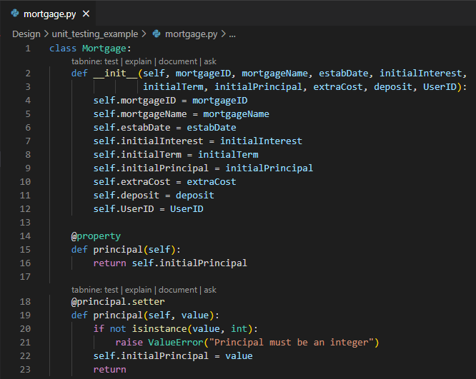

We will use Pytest for the Mortgage class. It checks if the initialized mortgage object has the correct principal value and whether it raises a ValueError when non-numeric values are passed for initialization parameters.

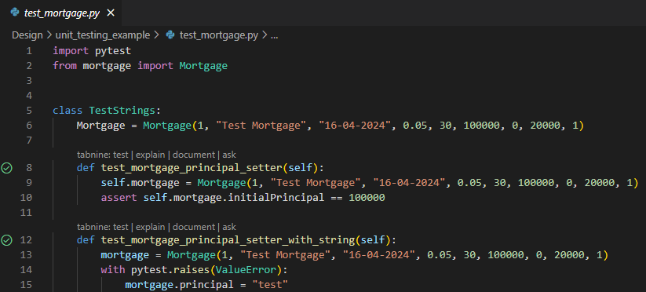

An example in the Pytest it will show you the results for the class TestStrings.
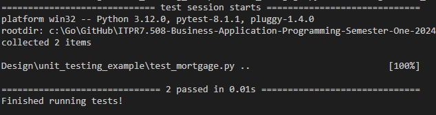

Test scenarios:
We will provide coverage of the unit's functionality, behavior, and interactions to ensure its correctness and reliability within our project.
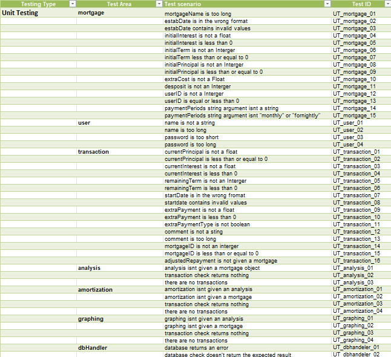
_Integration testing_
Where individual components or modules of a system are combined and tested as a group. The purpose of integration testing is to ensure that the interactions between these components work as expected and that the integrated system functions correctly as a whole.

For a small and straightforward project like a Mortgage Calculator, we will integrate all the components/modules and test the entire system as a whole, using the big bang integration testing approach. This approach is straightforward, as the interactions between components are relatively simple and easy to manage. Our project will use manual testing through the Pytest framework.

Test scenarios:
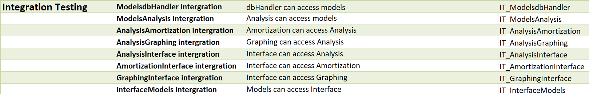
_System testing_
System Testing will be done by seeing if our softtware can be intergrated correctly with external systems that are used to make our software function properly. In this case, our application wont be working with too many eternal systems and will be easy to imperically test if they connect properly.

Test scenarios:
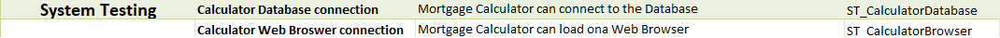
_User Acceptance Testing_
User Acceptance Testing will be done to ensure that when a potential user of our software does an action in our application that the correct response is shown to the user. These responses could be errors, new pages, confirmation windows and more.

We will want to thoroughly test this because gaps in these tests will directly impact the User Experience of our Application.

Test scenarios:
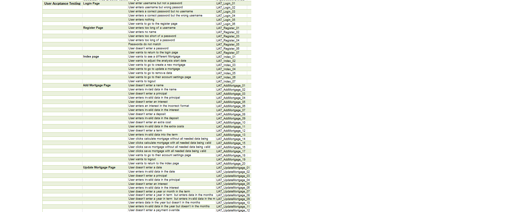

## Conclusion 
This document outlines our plan for building the mortgage calculator, which comes from feedback we got in a recent meeting with our client. We carefully looked at the business and program details, thinking about the problems we faced and the solutions we suggested. By really digging into the program details, we made sure we understood exactly what the project needs. When we were designing it, we focused on three main things: how the system works, how the data is organized, and how people will use it. 
We included diagrams and sketches to show how the software will work, what it's made of, and who will use it. These pictures help explain what the mortgage calculator does, what it can do, and who it's for. We set up a way to test the project to make sure it's good quality and dependable. We've got different tests to check that the mortgage calculator works right. By testing it a lot, we hope to find and fix any problems or mistakes, making the software better overall. 
This document is like a roadmap for making the mortgage calculator. We used feedback from our client and what we learned from the program details to plan it out. With clear designs, user-focused needs, and thorough testing, we want to create a tool that makes managing mortgages easier for our client. On top of the design stuff, we wrote a document about what users want. It looks at things from their point of view, spelling out what they expect and need. By listening to users and including their thoughts in our work, we want to make a mortgage calculator that works well.
